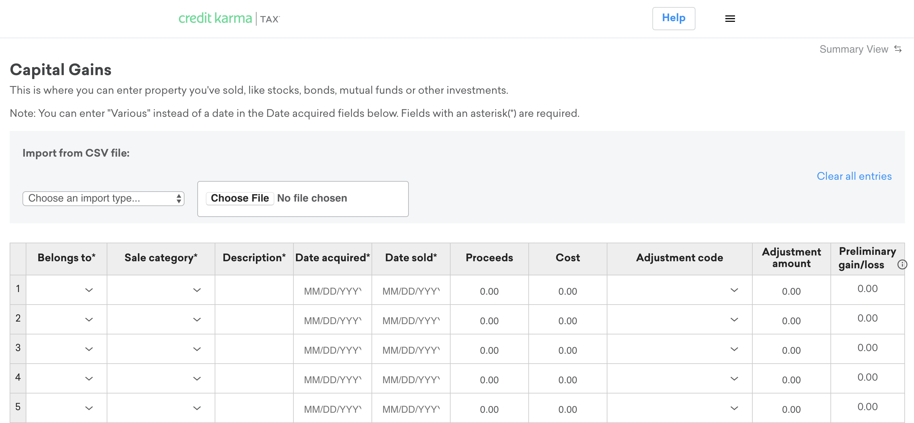

# CreditKarma Tax 1099-B Import Extension

Chrome Extension that adds features to the [CreditKarma Tax Capital Gains interface](https://tax.creditkarma.com/taxes/CapitalGainsFullListSummary.action) to allow CSV file imports.


## Tip Jar
<p>BTC: 3PPTchAAYfDTXhTAeRNv6fCgqUc4oY5YEx</p>
<p>ETH: 0x5a20056e08073e4411c18070ac514f440e8fbc1f</p>

## Install the Extension

1. Download ZIP of this repo
2. Open the "Extensions" page (chrome://extensions/) in the browser and turn on the "Developer mode".
3. Click on the "Load unpacked" button and select the directory where the build extension is placed.


After installation, go to Credit Karma Tax Home -> Investments -> Stocks, Mutual funds and bond sales, (1099-B) -> Spreadsheet entry. You will see a new section "Import from CSV file".




## Usage

CSV files can be imported by choosing a format in the dropdown, and then "Choose File" and selecting the csv file from your computer.

Your file data is only accessed in-browser (it is not sent, saved or processed outside your computer).

The import will not overwrite any rows on CreditKarma that already have a description, sale price or cost.

If Gain/Loss does not update, clicking "Next" will save/refresh those numbers.

You can clear the whole table by selecting "Clear all entries" and then click the green "Next" button.

This extension and software is not developed or affiliated with CreditKarma.com.

It it the users responsibility to review all imports to make sure they are correct.

## Known Issues

Does not import Adjustments


### Current Support For:

* [Fidelity](https://www.fidelity.com/) - Consolidated 1099 CSV
* [CoinTracking.info](https://cointracking.info/tax/) - Tax CSV Export
* [Bitcoin.tax](https://bitcoin.tax/home#reports) - Tax CSV Export
* [Cointracker.io](https://www.cointracker.io/) - Capital Gains CSV

### Default CSV Formatting

The default importer is looking for the following headers in row 1.

| Header Name     | Values          |
| -------------   |---------------|
| **belongsTo** | tp = Primary Tax Payer on the Account, sp = Spouse, bt = Both. In case this field does not exist in CSV it will be defaulted to Primary Tax Payer |
| **reportingCategory** | short: 1 = 1099 was reported, 2 = 1099 not reported, 3 = no 1099 long: 4 = 1099 was reported, 5 = 1099 not reported, 6 = no 1099 |
| **description** | description of sale |
| **dateAcquired** | mm/dd/yyyy |
| **dateSold** | mm/dd/yyyy |
| **salesPrice** | 0.00 |
| **costBasis** | 0.00 |
| **adjustmentCode** | code |
| **adjustmentAmount** | 0.00 |


Example default csv:
```
belongsTo, holdingType,reportingCategory,description,dateAcquired,dateSold,salesPrice,costBasis
tp, long,1,BTC,12/02/2007,03/04/2017,1234.50,325.55
sp, short,2,ETH,10/15/2016,03/04/2017,5500.55,5000.00
```


## License

[MIT License](LICENSE)

## Dev Stuff

<details><summary>Contributing</summary>


<p>Pull Requests are encouraged.</p>


<p>Importers are modules with the following properties:</p>

<p><b>textToLines(csvText)</b> - (optional) - function that takes the text of the csv file as a param, and returns an array of the rows. If this function is not provided, the default behavior is the first row of the csv is used as header properties, and returns an array of objects with named properties. [see importers/default.js](importers/default.js#L5)</p>


<p><b>parseCsvRow(csvRow)</b> - (required) - function that takes a row of the array returned from `textToLines` as a param, and returns an object with the following properties: [see importers/fidelity.js](importers/fidelity.js#L68)</p>


```javascript
{
    holdingType: "2",  // 1 for short, 2 for long
    reportingCategory: "3", // 1 for 1099 was reported, 2 for 1099 was not reported, 3 for no 1099
    description: "Sold this security",
    dateAcquired: "5/25/2016", // format mm/dd/yyyy
    dateSold: "5/25/2017", // format mm/dd/yyyy
    salesPrice: 5500.50,
    costBasis: 2500.00
}
```


Example Importer:

```javascript
var CKI = CKI || {};
CKI.Importers = CKI.Importers || {};

CKI.Importers.exampleImporter = {
	constants: {
		TYPE_COLUMN: "Gains Type",
		DESCRIPTION: "Description",
		ACQUIRED_COLUMN: "Date Acquired",
		SOLD_COLUMN: "Date Sold",
		COST_BASIS_COLUMN: "Cost Basis",
		PROCEEDS_COLUMN: "Proceeds"
	},

	parseCsvRow: function(sourceObj) {
		var obj = {
			holdingType: (sourceObj[this.constants.TYPE_COLUMN] == 'long')  ? "2" : "1",
			reportingCategory: "3",
			description: "Sold " + sourceObj[this.constants.DESCRIPTION],
			dateAcquired: (sourceObj[this.constants.ACQUIRED_COLUMN]) ? sourceObj[this.constants.ACQUIRED_COLUMN] : 'Various',
			dateSold: (sourceObj[this.constants.SOLD_COLUMN]) ? sourceObj[this.constants.SOLD_COLUMN] : 'Various',
			salesPrice: parseFloat(sourceObj[this.constants.PROCEEDS_COLUMN]),
			costBasis: parseFloat(sourceObj[this.constants.COST_BASIS_COLUMN])
		}
		return obj;
	}
};
```

</details>


